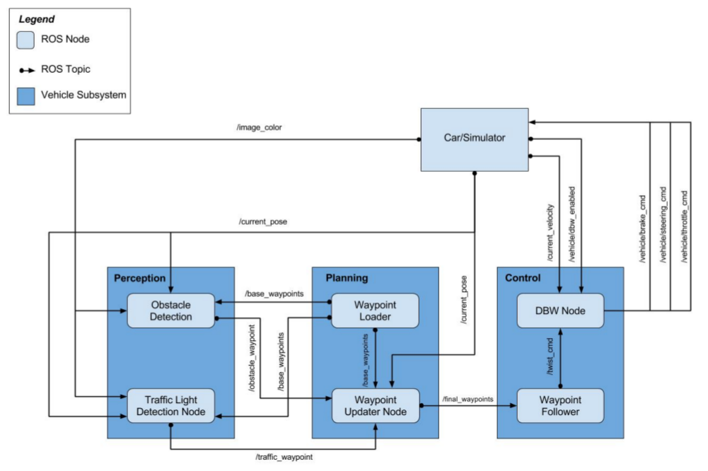
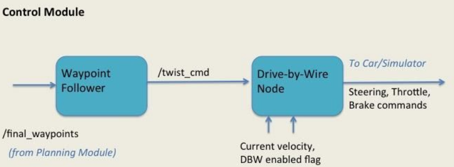

# Udacity Self-Driving Car - Capstone Project

This is the project repo for the final project of the Udacity Self-Driving Car Nanodegree: Programming a Real Self-Driving Car. For more information about the project, see the project introduction [here](https://classroom.udacity.com/nanodegrees/nd013/parts/6047fe34-d93c-4f50-8336-b70ef10cb4b2/modules/e1a23b06-329a-4684-a717-ad476f0d8dff/lessons/462c933d-9f24-42d3-8bdc-a08a5fc866e4/concepts/5ab4b122-83e6-436d-850f-9f4d26627fd9).

* Team : GiantCar

| Name           | Udacity account       | Slack Handle | Time Zone         |
|:---------------|:----------------------|--------------|-------------------| 
| Kim HyunKoo    | studian@gmail.com     | @hkkim       | UTC+9 (KST)       |
| Duong Hai Long | dhlong.hp@gmail.com   | @3x3eyes     | UTC+8 (Singapore) |
| Lee Wonjun     | mymamyma@gmail.com    | @mymamyma    | UTC -8 (PST)      |
| Xing Jin       | xingjin2017@gmail.com | @xing2017    | UTC -8 (PST)      |
| Zhao Minming   | minmingzhao@gmail.com | @minmingzhao | UTC -8 (PST)      |

## 1) Introduction

* This is the final capstone project in Udacity’s Self-Driving Car (SDC) Nanodegree. 
* In this project, we write code that will autonomously drive Udacity’s self-driving car `Carla`, an actual car equipped with necessary sensors and actuators, around a small test track. 
* We test and develop the code on a simulated car using a simulator provided by Udacity.
* The project brings together several modules taught in the Nanodegree: Perception, Motion Planning, Control, etc. The code is written using the well-known Robotics Operating System (ROS) framework which works both on the simulator as well as the actual car.

## 2) System Architecture

* The architecture of the system is depicted below. 
* The system consists of three key modules: `Perception`, `Planning`, and `Control`. 
* Each module consists of one or more ROS nodes, which utilize publish/subscribe (pub-sub) and request/response patterns to communicate critical information with each other while processing information that helps to drive the car.
* At a high level perspective, `the Perception module` includes functionality that perceives the environment using attached sensors (cameras, lidars, radars, etc.), such as lane lines, traffic lights, obstacles on the road, state of traffic lights, etc.
* This information is passed to `the Planning module`, which includes functionality to ingest the perceived environment, and uses that to publish a series of waypoints ahead of the car along with target velocities. The waypoints constitute
a projected trajectory for the car. 
* `The Control module` takes the waypoints and executes the target velocities on the car’s controller. 
* The car is equipped with a drive-by-wire (DBW) functionality that allows the controller to set its throttle (acceleration and deceleration), brake and steering angle commands. 
* When the commands are executed, the car drives itself on the calculated trajectory. 
* The entire cycle repeats itself continually so that the car continues driving.
* The modules are implemented as a set of ROS Nodes. 
* Some nodes are implemented by Udacity, while other nodes are implemented by my self.

<p align="left">
    <br>
    <b>Figure 1. System Architecture</b><br>
</p>

## 3) Implementation

* As the Figure 1 above shows, there are six ROS nodes in three different modules. 
* Of these, I implement three ROS nodes: `Traffic Light Detector`, `Waypoint Updater` and `Drive-by-Wire (DBW)`. 
* Of the other three nodes, two are implemented by Udacity: `Waypoint Loader node`, and `Waypoint Follower`. 
* The last one (Obstacle Detector) is implemented as part of Traffic Light Detector.

### 1. Perception module

* In this project, the Perception module has two ROS nodes: Obstacle Detector and Traffic Light Detector.
* The Obstacle Detector is not required by the project rubric. 
* The discussion below is for the Traffic Light Detector node.

#### 1-1. Traffic light detector

- subscribed topics:
	- `/base_waypoints`: provides a complete list of waypoints on the course
	- `/current_pose` : provides the car’s current position on the course
	- `/image_color` : provides an image stream from the car’s camera

- published topics:
	- `/traffic_waypoint`: 

- helper topics:
	- `/vehicle/traffic_lights`: simulator publishes the location and current color state of all traffic lights in the simulator. It can be used for training data collection or as a stub for testing of other components.

- node files:
	- `tl_detector/tl_detector.py`: node file
	- `tl_detector/light_classification/tl_classifier.py`: classifier file
	
#### 1-2. Obstacle Detector

- NOT implement

### 2. Planning module

<p align="left">
    <br>
    <b>Figure 2. Planning Module</b><br>
</p>

* This project implements the `Waypoint Updater` node. 
* The purpose of the Waypoint Updater node is to update the target velocities of final waypoints, based on traffic lights,  state of the lights, and other obstacles.

#### 2-1. Waypoint Updater

- subscribed topics:
	- `/base_waypoints` : containing all the waypoints in front of, and behind, the vehicle
	- `/obstacle_waypoints` : the waypoints that are obstacles (not used). This information comes from the Perception module
	- `/traffic_waypoint` : the waypoint of the ​ red traffic light ahead of the car. This information comes from the Perception module
	- `/current_pose` : the current position of the vehicle, as obtained by the actual car, or the simulator
	
- published topics:
	- `/final_waypoints` : this is a list of <N> waypoints ahead of the car (in order from closest to farthest) and the target velocities for those waypoints.
	
- node files:
	- `waypoint_updater/waypoint_updater.py`: node file

### 3. Control module

<p align="left">
    <br>
    <b>Figure 3. Control Module</b><br>
</p>

* Our project implements the `Drive-by-Wire (DBW)` node.
* The `DBW` node commands the car or the simulator by providing it with appropriate commands to control the `throttle`(acceleration/deceleration), `brake` and s`teering angle`.
* The DBW node instantiates two controllers (longitudinal contoller and lateral contoller)
* Longitudinal contoller 
	* takes as input the target speed (as mentioned in the /twist_cmd), the current speed and time delta.
	* control throttle and brake using PID contol algorithm.	
* Lateral contoller
	* takes a target yaw rate, the current speed, current position, the following waypoints.
	* calculates the required steering angle, while attempting to be within required tolerance limits for minimum and maximum steering angles.
	
#### 3-1. Drive-by-Wire (DBW)

- subscribed topics:
	- /twist_cmd : contains commands for proposed linear and angular velocities
	- /vehicle/dbw_enabled : a flag to show if the car is under DBW control or Driver control
	- /current_pose : contains current position of the car
	- /current_velocity : contains current velocity of the car
	- /final_waypoints : contains the list of final waypoints

- published topics:
	- `/vehicle/throttle_cmd` : the throttle value
	- `/vehicle/steer_cmd` : the steering angle value
	- `/vehicle/brake_cmd` : the brake value

- node files:
	- `twist_controller/dbw_node.py`

## 4) Project Simulation Result

<p align="left">
    <br>
    <b>Figure 4. Project Result</b><br>
</p>

## 5) Simulation Method

### 1. Setup Environment

* This project is running Ubuntu 16.04.
* Follow these instructions to install ROS
  * [ROS Kinetic](http://wiki.ros.org/kinetic/Installation/Ubuntu) if you have Ubuntu 16.04.
* [Dataspeed DBW](https://bitbucket.org/DataspeedInc/dbw_mkz_ros)
  * Use this option to install the SDK on a workstation that already has ROS installed: [One Line SDK Install (binary)](https://bitbucket.org/DataspeedInc/dbw_mkz_ros/src/81e63fcc335d7b64139d7482017d6a97b405e250/ROS_SETUP.md?fileviewer=file-view-default)
* Download the [Udacity Simulator](https://github.com/udacity/CarND-Capstone/releases/tag/v1.2).

### 2. Usage Simulation

#### 2-1. Clone the project repository

```bash
git clone https://github.com/udacity/CarND-Capstone.git
```

#### 2-2. Install python dependencies

```bash
cd CarND-Capstone
pip install -r requirements.txt
```
#### 2-3. Make and run styx

```bash
cd ros
catkin_make
source devel/setup.sh
roslaunch launch/styx.launch
```
Run the simulator

#### 2-4. Real world testing

1. Download [training bag](https://drive.google.com/file/d/0B2_h37bMVw3iYkdJTlRSUlJIamM/view?usp=sharing) that was recorded on the Udacity self-driving car (a bag demonstraing the correct predictions in autonomous mode can be found [here](https://drive.google.com/open?id=0B2_h37bMVw3iT0ZEdlF4N01QbHc))

2. Unzip the file
```bash
unzip traffic_light_bag_files.zip
```

3. Play the bag file
```bash
rosbag play -l traffic_light_bag_files/loop_with_traffic_light.bag
```

4. Launch your project in site mode
```bash
cd CarND-Capstone/ros
roslaunch launch/site.launch
```

5. Confirm that traffic light detection works on real life images
